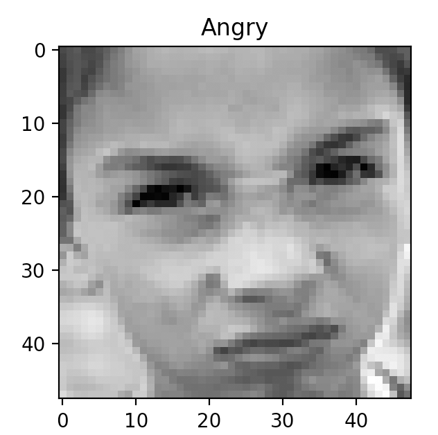
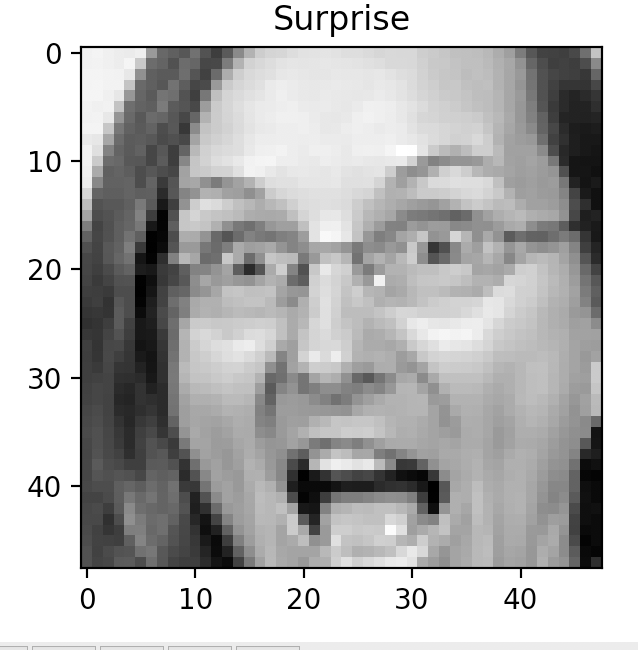
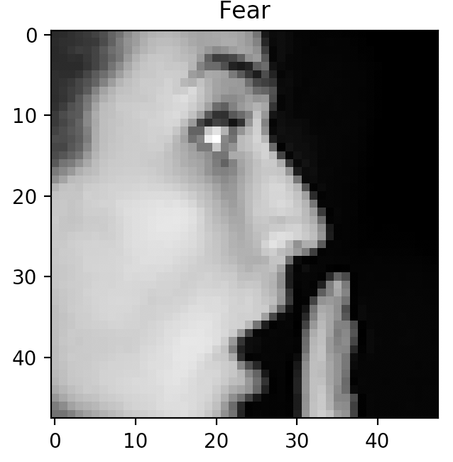
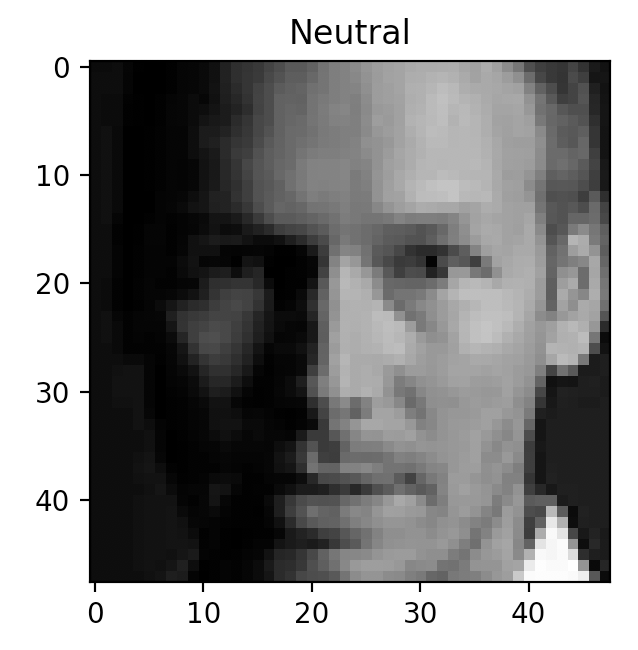
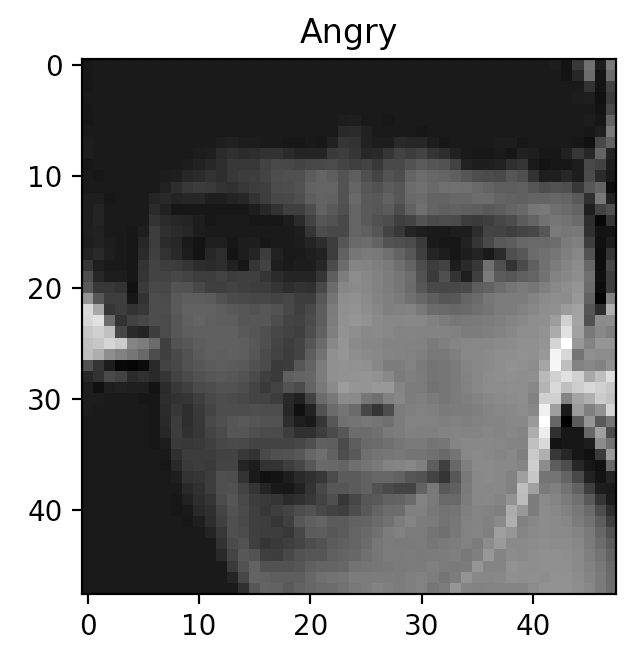

# Facial-Expressions-Recognition
Recognising facial expressions using simple neural networks coded in numpy


Data obtained from https://www.kaggle.com/c/challenges-in-representation-learning-facial-expression-recognition-challenge

### Data

Images are classified into several expressions like Angry, Sad, Surprised etc. Some examples are shown below 

>>     

>>>>>  


### Repo Structure


```
.
├── Code
│   ├── __pycache__
│   │   ├── lputil.cpython-37.pyc
│   │   ├── util.cpython-36.pyc
│   │   └── util.cpython-37.pyc
│   ├── ann_binary.py
│   ├── ann_multi.py
│   ├── logistic.py
│   ├── lp_sigmoid.py
│   ├── lputil.py
│   ├── show_images.py
│   └── util.py
├── Images
│   ├── Angry.png
│   ├── Angry2.png
│   ├── Fear.png
│   ├── Neutral.png
│   └── Surprise.png
└── README.md
```
